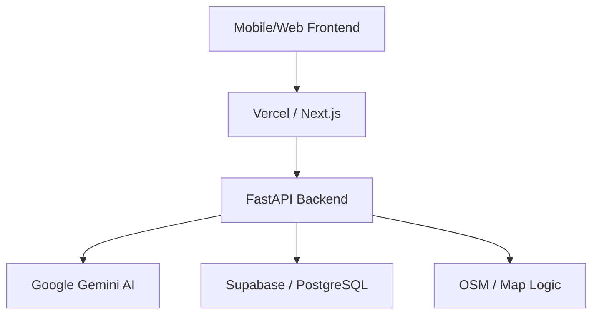

# Fitola - AI-Powered Personal Fitness & Social Wellness

[](https://github.com/saanjaypatil78/fitola/actions/workflows/ci.yml)
[](https://opensource.org/licenses/MIT)
[](https://www.python.org/downloads/)
[](https://fastapi.tiangolo.com)

Fitola is a next-generation wellness platform combining personalized AI fitness plans, real-time social engagement via "FitBuddies," and privacy-first location sharing.

## 🚀 Key Features

- **🧠 AI Brain**: Personalized workout and nutrition plans powered by Gemini 2.5 Flash.
- **💬 FitChat**: Real-time social messaging with integrated translation.
- **📍 FitBuddy Locator**: Find workout partners nearby with a privacy-first "Ghost Mode."
- **🛡️ Privacy-First**: Secure data handling with Supabase and optional location masking.
- **⚡ Performance**: High-concurrency backend built with FastAPI and asynchronous processing.

## 🏗️ Technical Architecture



## 🛠️ Tech Stack

- **Backend**: Python 3.10, FastAPI, Pydantic, Uvicorn
- **AI**: Google Generative AI (Gemini 2.5)
- **Database**: Supabase (PostgreSQL)
- **Deployment**: Vercel (Serverless Functions)
- **CI/CD**: GitHub Actions

## 📥 Installation

1. **Clone the repository**:
   ```bash
   git clone https://github.com/saanjaypatil78/fitola.git
   cd fitola
   ```

2. **Set up environment**:
   ```bash
   python -m venv venv
   source venv/bin/activate  # Windows: venv\Scripts\activate
   pip install -r requirements.txt
   ```

3. **Configure environment variables**:
   ```bash
   cp .env.example .env
   # Add your GEMINI_API_KEY (and optional GEMINI_MODEL), SUPABASE keys, and RUBE_MCP_JWT to .env
   ```

4. **Run development server**:
   ```bash
   uvicorn backend.main:app --reload
   ```

## 🧪 Testing

```bash
pytest
```

## 📜 License

Distributed under the MIT License. See `LICENSE` for more information.

---
Developed with ❤️ by [Sanjay Santosh Patil](https://github.com/saanjaypatil78)
