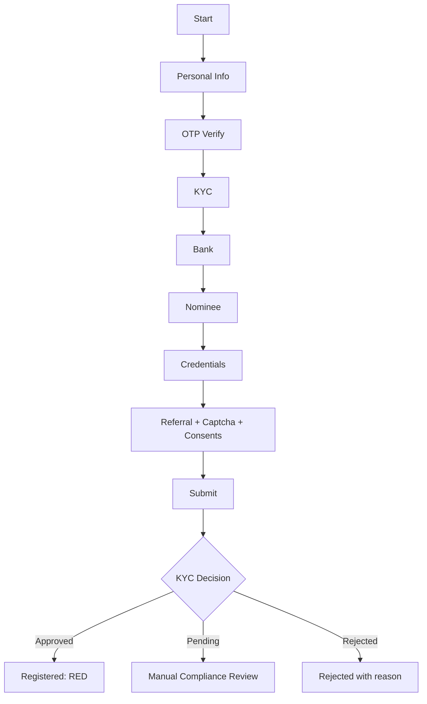

# 📱 SECURE REGISTRATION MODULE - TECHNICAL DOCUMENTATION
## Version: 2.0 | Status: Production Ready | Compliance: KYC/AML

## 1. OVERVIEW

### 1.1 Purpose
This document defines the registration module for Sunray with KYC-compliant identity capture, bank validation, nominee validation, OTP checks, and RBAC controls.

### 1.2 Scope
- 5-step registration capture
- Aadhaar + PAN + bank verification gates
- Mandatory referral code validation
- OTP and captcha checks
- Role-level access restrictions

## 2. SECURITY & COMPLIANCE STANDARDS

```typescript
// src/lib/registration/verification-config.ts

export const VERIFICATION_CONFIG = {
  CONTACT_OTP_LENGTH: 6,
  CONTACT_OTP_EXPIRY_SECONDS: 300,
  CONTACT_MAX_ATTEMPTS: 3,
  EMAIL_OTP_LENGTH: 6,
  EMAIL_OTP_EXPIRY_SECONDS: 300,
  EMAIL_MAX_ATTEMPTS: 3,
  KYC_VERIFICATION_REQUIRED: true,
  KYC_VERIFICATION_LEVEL: 'LEVEL_2',
  KYC_AUTO_VERIFICATION: false,
  BANK_VERIFICATION_METHOD: 'PENNY_DROP',
  BANK_VERIFICATION_AMOUNT: 1,
  CAPTCHA_PROVIDER: 'GOOGLE_RECAPTCHA_V3',
  CAPTCHA_MIN_SCORE: 0.5,
  DATA_PROTECTION_ACT: 'DPDP-2023',
  GDPR_COMPLIANT: true,
  AADHAAR_STORAGE_POLICY: 'ENCRYPTED_HASH_ONLY',
  DATA_RETENTION_YEARS: 7,
} as const;
```

## 3. REGISTRATION FORM FIELDS

### 3.1 Personal Information
| Field | Validation | Required |
| :--- | :--- | :--- |
| First Name | 2-50 alphabetic chars | Yes |
| Middle Name | <=50 alphabetic chars | No |
| Last Name | 2-50 alphabetic chars | Yes |
| Contact No | Valid Indian mobile pattern | Yes |
| Email Id | RFC 5322 valid email | Yes |

### 3.2 KYC
| Field | Validation | Required |
| :--- | :--- | :--- |
| Aadhaar No | 12 digits + checksum | Yes |
| PAN No | `ABCDE1234F` pattern | Yes |
| Address | Aadhaar-linked preferred | Yes |

### 3.3 Bank (Applicant)
| Field | Validation | Required |
| :--- | :--- | :--- |
| Bank Name | IFSC registry match | Yes |
| Acc No | 9-18 digits | Yes |
| IFSC | 11-char IFSC pattern | Yes |
| Account Holder Name | KYC-name match | Yes |

### 3.4 Nominee (Beneficiary)
| Field | Validation | Required |
| :--- | :--- | :--- |
| Full Name | 2-100 alphabetic chars | Yes |
| Contact No | Valid Indian mobile | Yes |
| Relation | Controlled enum | Yes |
| Aadhaar/PAN | Standard validation | Yes |
| Bank Details | Same as applicant validations | Yes |
| Age | Must be >18 | Yes |

### 3.5 Account Security
| Field | Validation | Required |
| :--- | :--- | :--- |
| Referral Code | Existing code in referral table | Yes |
| Username | 6-20, alphanumeric + underscore | Yes |
| Password | >=8 with upper/lower/num/symbol | Yes |
| Contact OTP | 6-digit, non-expired | Yes |
| Email OTP | 6-digit, non-expired | Yes |
| Captcha | Server-side valid token | Yes |
| Terms + Risk Disclosure | Must be checked | Yes |

## 4. USER FLOW



## 5. RBAC FOR REGISTRATION

```typescript
// src/middleware/registration-rbac.ts

export const REGISTRATION_RBAC = {
  PERSONAL_INFO: { requiredPermissions: ['reg:create', 'reg:update'], minLevel: 1 },
  KYC_DETAILS: { requiredPermissions: ['reg:create', 'reg:update'], minLevel: 2 },
  BANK_DETAILS: { requiredPermissions: ['reg:create', 'reg:update'], minLevel: 3 },
  NOMINEE_DETAILS: { requiredPermissions: ['reg:create', 'reg:update'], minLevel: 3 },
  ACCOUNT_SECURITY: { requiredPermissions: ['reg:create', 'reg:update'], minLevel: 2 },
  KYC_VERIFICATION: {
    requiredPermissions: ['kyc:verify', 'kyc:reject'],
    minLevel: 6,
    excludeRoles: ['GUEST', 'REGISTERED', 'INVESTOR', 'VENDOR'],
  },
} as const;
```

## 6. API ENDPOINTS

| Method | Endpoint | Description | Min Level |
| :--- | :--- | :--- | :--- |
| POST | `/api/auth/register/init` | Save personal details | 1 |
| POST | `/api/auth/register/kyc` | Save Aadhaar/PAN | 2 |
| POST | `/api/auth/register/bank` | Save bank details | 3 |
| POST | `/api/auth/register/nominee` | Save nominee details | 3 |
| POST | `/api/auth/register/security` | Set credentials | 2 |
| POST | `/api/auth/register/submit` | Final submit | 2 |
| POST | `/api/auth/otp/send` | Send OTP | 2 |
| POST | `/api/auth/otp/verify` | Verify OTP | 2 |
| POST | `/api/auth/referral/validate` | Validate referral code | 2 |

## 7. VALIDATION REFERENCE

```typescript
// src/lib/registration/server-validation.ts

import { z } from 'zod';

export const REGISTRATION_SCHEMAS = {
  PERSONAL_INFO: z.object({
    firstName: z.string().min(2).max(50).regex(/^[A-Za-z]+$/),
    middleName: z.string().max(50).regex(/^[A-Za-z]+$/).optional(),
    lastName: z.string().min(2).max(50).regex(/^[A-Za-z]+$/),
    contactNo: z.string().regex(/^[+]?[91]?[6-9]\d{9}$/),
    email: z.string().email(),
  }),
};

export type ValidationResult =
  | { valid: true }
  | { valid: false; error?: string; errors?: Array<{ field: string; message: string }> };

export async function validateRegistrationData(
  section: keyof typeof REGISTRATION_SCHEMAS,
  data: unknown
): Promise<ValidationResult> {
  try {
    await REGISTRATION_SCHEMAS[section].parseAsync(data);
    return { valid: true };
  } catch (error) {
    if (error instanceof z.ZodError) {
      return {
        valid: false,
        errors: error.errors.map((e) => ({ field: e.path.join('.'), message: e.message })),
      };
    }

    return { valid: false, error: 'Validation failed' };
  }
}
```

## 8. TESTING REQUIREMENTS

- Unit tests for field validators (positive + negative cases)
- Integration tests for each registration endpoint
- E2E flow for full registration journey
- Security tests for OTP expiry, replay prevention, and captcha failures
- RBAC tests for allow/deny matrix by level

**END OF REGISTRATION MODULE DOCUMENTATION**
